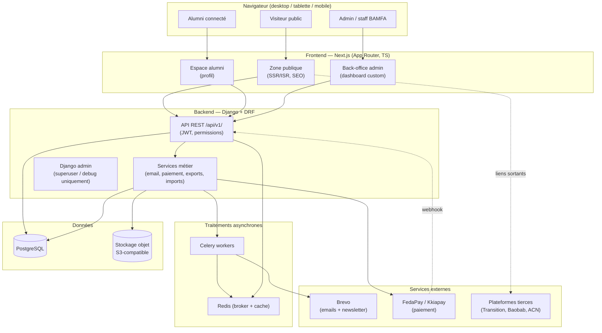
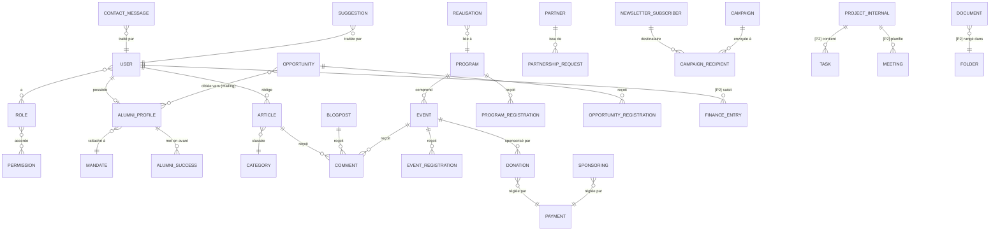
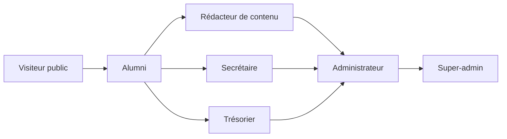

# Plateforme BAMFA — Document de référence d'architecture & socle technique

> **Type** : Spec d'architecture transverse (livrable clé du Sprint 1 — « Document de référence de Vibe coding »)
> **Date** : 2026-06-20
> **Statut** : Validé pour rédaction du plan d'implémentation
> **Sources** : `docs/Cahier de charge Plateforme BAMFA.pdf`, `docs/Decoupage Sprint Bamfa.pdf`

---

## 1. Objet et portée de ce document

Le projet BAMFA est vaste (site vitrine public + espace alumni + back-office complet + modules internes). Il est **trop grand pour une seule spec d'implémentation**.

Ce document est la **référence transverse** : il fixe la stack, l'architecture système, le modèle de données global, le découpage en modules, le modèle de rôles et les conventions communes. Il ne contient **pas** le détail d'implémentation de chaque écran.

**Chaque module/sprint fera ensuite l'objet de sa propre mini-spec + plan d'implémentation** (cycle : brainstorm → spec → plan → exécution), en s'appuyant sur les fondations posées ici.

### Ce qui est dans ce document
- Vision, périmètre, priorités (P0/P1/P2)
- Stack technique et justifications
- Architecture système (topologie découplée)
- Structure du dépôt (monorepo)
- Modèle de données global (ERD)
- Découpage en modules (apps Django ↔ zones Next.js)
- Modèle de rôles et permissions
- Intégrations externes (paiement, email, plateformes tierces)
- Conventions transverses (API, erreurs, i18n, tests)
- Stratégie de déploiement
- Correspondance modules ↔ sprints

### Ce qui n'est PAS dans ce document
- Le détail champ-par-champ de chaque formulaire
- Les maquettes pixel-perfect (le projet remplace Figma par du « vibe coding » guidé)
- Le plan d'implémentation détaillé (objet du document suivant)

---

## 2. Contexte et objectifs

**BAMFA** (Benin Association of the Mastercard Foundation Alumni) souffre d'un déficit de visibilité numérique et n'a pas de base centralisée de ses alumni.

**Objectif général** : mettre en place une plateforme numérique intégrée (site vitrine public + espace alumni sécurisé + back-office) pour :
1. Rendre BAMFA visible en ligne (priorité absolue).
2. Permettre à BAMFA de publier et gérer ses contenus sans développeur.
3. Centraliser les alumni dans une base fiable.
4. Faciliter la communication avec membres et partenaires.
5. Ajouter ensuite les modules internes (secrétariat, documents, finances, projets, réunions, reporting).

**Délai** : 3 mois / 12 semaines / 6 sprints de 2 semaines, en 2 phases.

---

## 3. Décisions structurantes (validées)

| Sujet | Décision | Justification |
|---|---|---|
| Framework backend | **Django + Django REST Framework** | ORM mature, sécurité, écosystème riche, productivité |
| Framework frontend | **Next.js (App Router, TypeScript)** | SSR/ISR pour le SEO du site public, un seul stack front |
| Back-office | **Dashboard Next.js 100 % custom** (consomme l'API DRF) | UX cohérente public ↔ admin, sur-mesure |
| Comptes alumni | **Inscription en ligne → validation admin → l'alumni gère son profil** | La plateforme Transition reste un lien externe |
| Paiement | **Agrégateur local FedaPay/Kkiapay** (Mobile Money + carte) | Adapté au contexte béninois |
| Emailing | **Brevo** (transactionnel + newsletter/campagnes) | Couvre notifs + envois ciblés + newsletter |
| Périmètre | **Tout le cahier des charges**, priorisé P0/P1/P2 | Phase 1 publique, Phase 2 interne |
| Profondeur gestion interne | **Version légère** (statuts simples, pas de Gantt) | Confirmé par le découpage |
| Profondeur finances | **Suivi simple** (entrées/dépenses/budgets/justificatifs) | « Livrer d'abord une version simple » |

### Recommandations techniques complémentaires (à confirmer)
| Sujet | Recommandation |
|---|---|
| Base de données | **PostgreSQL** |
| Authentification | **DRF SimpleJWT**, tokens en cookies httpOnly |
| Tâches asynchrones | **Celery + Redis** (mails de masse, exports, imports) |
| Stockage fichiers | **S3-compatible** en prod, système de fichiers local en dev |
| Exports | **WeasyPrint** (PDF) + **openpyxl** (Excel) |
| Doc API | **drf-spectacular** (OpenAPI) → client TypeScript auto-généré |
| Conteneurisation | **Docker Compose** (hébergement final à arbitrer) |

---

## 4. Architecture système (topologie découplée)

Architecture **headless** : un backend Django/DRF expose une API REST consommée par un frontend Next.js unique (zones publique, alumni, admin). Les traitements lourds sont délégués à Celery. Les services externes sont encapsulés derrière des couches d'abstraction.



**Points clés**
- Le site public est rendu en **SSR/ISR** pour le référencement et la performance.
- Le **paiement** fonctionne en mode redirection/checkout + **webhook** de confirmation côté Django (source de vérité = le webhook, jamais le retour navigateur).
- Les **envois d'emails de masse** (opportunités ciblées, newsletter) passent par Celery pour ne pas bloquer les requêtes.
- Les **plateformes tierces** (Transition, Baobab, ACN) sont de simples **liens sortants** (pas d'intégration API au démarrage).

---

## 5. Structure du dépôt (monorepo)

```
bamfa/
├── backend/                 # Django + DRF
│   ├── config/              # settings (base/dev/prod), urls, wsgi/asgi, celery
│   ├── apps/
│   │   ├── accounts/        # users, rôles, auth, permissions
│   │   ├── cms/             # pages institutionnelles, actualités, blogs
│   │   ├── programs/        # programmes
│   │   ├── projects/        # projets publics
│   │   ├── realisations/    # réalisations + succès alumni
│   │   ├── events/          # événements + inscriptions
│   │   ├── opportunities/   # opportunités + inscriptions + partage ciblé
│   │   ├── partners/        # partenaires + demandes de partenariat
│   │   ├── alumni/          # profils alumni, annuaire, validation
│   │   ├── forms/           # contact, suggestion, "Souvenir BAMFA"
│   │   ├── newsletter/      # abonnements + campagnes
│   │   ├── comments/        # commentaires + modération
│   │   ├── donations/       # dons + sponsoring + paiement
│   │   ├── messaging/       # envoi d'emails depuis l'admin
│   │   ├── stats/           # statistiques / tableaux de bord
│   │   ├── secretariat/     # [P2] courriers, notes, CR, PV, décisions
│   │   ├── documents/       # [P2] GED + archives + droits d'accès
│   │   ├── pm/              # [P2] projets/tâches/équipes/réunions internes
│   │   ├── finance/         # [P2] trésorerie, budgets, justificatifs
│   │   └── reporting/       # [P2] bilans, exports PDF/Excel, rapports
│   ├── common/              # utilitaires partagés (pagination, erreurs, mixins)
│   └── tests/               # pytest
│
├── frontend/                # Next.js (App Router, TypeScript)
│   ├── app/
│   │   ├── (public)/        # accueil, à propos, programmes, actualités, etc.
│   │   ├── (alumni)/        # espace alumni connecté
│   │   └── (admin)/         # back-office custom
│   ├── components/          # design system + composants partagés
│   ├── lib/                 # client API typé (généré depuis OpenAPI), auth
│   └── tests/               # Vitest + Playwright
│
├── docs/                    # specs, ADR, diagrammes, guides
└── docker/                  # docker-compose, Dockerfiles, configs nginx
```

**Principe** : une app Django = un module métier à responsabilité unique, avec son `models / serializers / views / permissions / services / tests`. Quand un fichier grossit trop, c'est le signe qu'il faut le scinder.

---

## 6. Modèle de données global (ERD)

Vue d'ensemble des entités principales. (Les modules P2 sont indiqués ; leur détail sera affiné dans leurs specs respectives.)



### Entités transverses importantes
- **USER** : compte unique pour tous les profils authentifiés (alumni, staff). Email = identifiant.
- **ALUMNI_PROFILE** : étend USER pour les alumni (statut : `en_attente` / `validé` / `suspendu` / `rejeté`).
- **MANDATE** : période/mandat de l'équipe BAMFA (permet « équipe par mandat »).
- **PAYMENT** : entité commune référencée par dons et sponsorings, liée au statut du webhook FedaPay/Kkiapay.
- **PublishableMixin** : champ `statut` (`brouillon` / `publié` / `dépublié`) partagé par les contenus (articles, blogs, événements, opportunités, programmes, projets, réalisations).

---

## 7. Modèle de rôles et permissions

Rôles définis **dès le Sprint 1** (recommandation du découpage : « Définir les rôles dès le Sprint 1 »).



| Rôle | Périmètre |
|---|---|
| **Visiteur public** | Consultation site, formulaires publics, inscription événements/opportunités, dons |
| **Alumni** | Tout le public + gestion de son profil + annuaire connecté |
| **Rédacteur de contenu** | CRUD contenus (actualités, blogs, événements, programmes, réalisations) + modération commentaires |
| **Secrétaire** | [P2] Module secrétariat + documents/archives |
| **Trésorier** | [P2] Module finances + dons/sponsoring |
| **Administrateur** | Validation alumni/partenariats, gestion globale, envoi mails ciblés, stats |
| **Super-admin** | Gestion des utilisateurs internes, rôles, permissions avancées, journal d'activité |

**Implémentation** : groupes + permissions Django, permissions objet (ex. droits d'accès aux documents en P2) là où nécessaire. L'API DRF applique les permissions par endpoint ; le front masque/affiche selon le rôle (UX), mais **l'autorité reste côté backend**.

---

## 8. Intégrations externes

### 8.1 Paiement (FedaPay / Kkiapay)
- Couche d'abstraction `PaymentProvider` (interface) → implémentation FedaPay/Kkiapay, branchable/remplaçable.
- Flux : front initie → backend crée une transaction `en_attente` → redirection checkout → **webhook** confirme/échoue → mise à jour du `PAYMENT` → notification email.
- **Source de vérité = le webhook**, jamais le retour navigateur.
- Alternative manuelle prévue au démarrage (mesure d'atténuation du découpage).

### 8.2 Email (Brevo)
- **Transactionnel** : validation/rejet inscription, confirmation contact, confirmation inscription événement, reçu de don.
- **Ciblé** : partage d'opportunités vers une sélection d'alumni (filtrée par critères).
- **Newsletter/campagnes** : abonnés → campagnes via Celery.
- Backend email Django configuré sur l'API Brevo + couche d'abstraction pour les campagnes.

### 8.3 Plateformes tierces (Transition MCF, Baobab, ACN)
- **Liens sortants uniquement** au démarrage (pas d'intégration API).
- La synchronisation alumni depuis Transition est traitée comme un **import (CSV/manuel)** tant qu'aucune API n'est disponible — encapsulée dans un service dédié pour évoluer plus tard.

---

## 9. Conventions transverses

- **API** : REST versionnée sous `/api/v1/`, nommage cohérent, pagination par défaut, filtres/recherche standardisés (django-filter).
- **Schéma & client** : OpenAPI via drf-spectacular → **client TypeScript généré** côté Next.js (pas de typage manuel des réponses).
- **Erreurs** : format d'erreur normalisé (code, message, détails par champ) consommé uniformément par le front.
- **Langue** : **français** pour toute l'UI et les contenus.
- **Tests** : `pytest` + factories côté backend (services métier et endpoints critiques) ; Vitest (unitaire) + Playwright (parcours clés) côté frontend. Approche **TDD** sur la logique métier.
- **Données de démo** : commandes de seed pour peupler un environnement de démonstration (utile pour les démos bi-hebdomadaires à BAMFA).
- **Sécurité** : mots de passe hashés (défaut Django), HTTPS/SSL, protection données personnelles, sauvegardes régulières, journal d'activité (P2).

---

## 10. Déploiement

- **Docker Compose** : services `web` (Django/Gunicorn), `worker` (Celery), `redis`, `db` (PostgreSQL), `frontend` (Next.js), `nginx` (reverse proxy + SSL).
- Configuration par variables d'environnement (`.env`), settings séparés dev/prod.
- Sauvegarde/restauration PostgreSQL planifiée ; stockage objet pour les fichiers.
- **Hébergement final à arbitrer** (VPS, plateforme managée…) — sans impact sur l'architecture grâce à la conteneurisation.

---

## 11. Correspondance modules ↔ sprints

| Sprint | Semaines | Phase | Modules / livrables |
|---|---|---|---|
| **1** | 1-2 | 1 | Socle : monorepo, `accounts` (auth/rôles), design system, pages publiques statiques, **ce document** |
| **2** | 3-4 | 1 | `cms`, `programs`, `projects`, `realisations`, `events`, `opportunities`, `partners`, `alumni`, `forms`, `newsletter`, `comments`, `donations`, `messaging` + back-office associé |
| **3** | 5-6 | 1 | Tests, recette, responsive, emails, **mise en production V1** |
| **4** | 7-8 | 2 | `secretariat`, `documents` (GED/archives), gestion accès internes, journal d'activité |
| **5** | 9-10 | 2 | `pm` (projets/tâches/équipes/réunions), `finance` (trésorerie) |
| **6** | 11-12 | 2 | `reporting` (stats avancées, bilans, exports PDF/Excel), sécurité, formation, **V2 finale** |

### Priorisation (rappel)
- **P0** (indispensable mise en ligne) : pages institutionnelles, contenus, contact, newsletter, auth admin, alumni + annuaire + validation, événements, opportunités, envoi mails alumni, formulaires partenariat/suggestion.
- **P1** (visibilité renforcée) : blogs, dons/sponsoring, Souvenir BAMFA, équipe par mandat, commentaires, partenaires, redirections tierces, succès alumni, stats de base, notifications email.
- **P2** (interne, Phase 2) : secrétariat, documents/archives, projets/tâches/équipes/réunions, trésorerie/finances, exports, stats avancées, rapports d'impact.

---

## 12. Risques et garde-fous (rappel du découpage)

| Risque | Garde-fou |
|---|---|
| Trop de fonctionnalités pour 3 mois | Respect strict P0 → P1 → P2 ; le choix du back-office custom **renforce** cette discipline |
| Données alumni incomplètes | Formulaire de mise à jour simple + statut de complétude |
| Complexité du module finance | Version simple d'abord, amélioration ensuite |
| Problèmes de paiement | Alternative manuelle au démarrage |
| Mauvaise gestion des droits | Rôles définis dès le Sprint 1 (section 7) |
| Dépendance aux développeurs | Documentation claire + admin sans compétence technique |

---

## 13. Prochaines étapes

1. **Validation de ce document** par BAMFA / le porteur.
2. **Plan d'implémentation du Sprint 1** (socle technique) via le cycle de planification.
3. Spec + plan dédiés pour chaque module à mesure de l'avancement des sprints.
