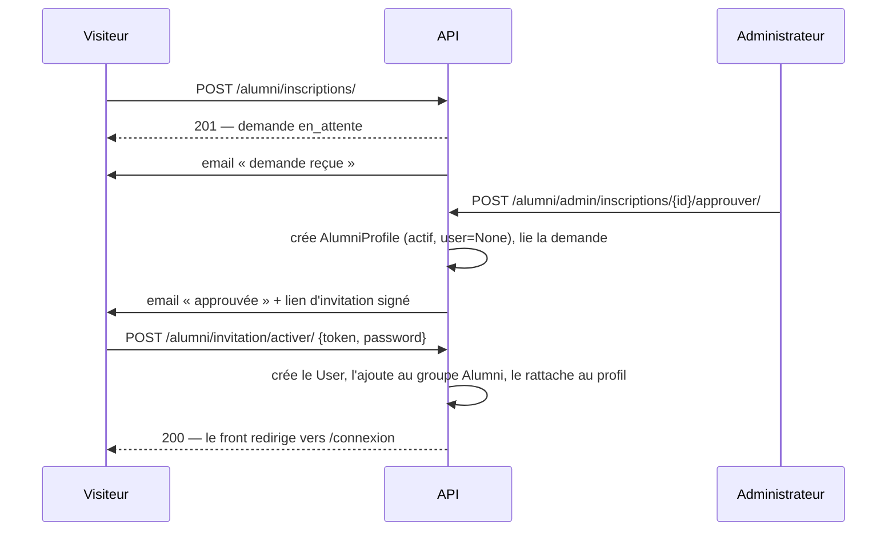
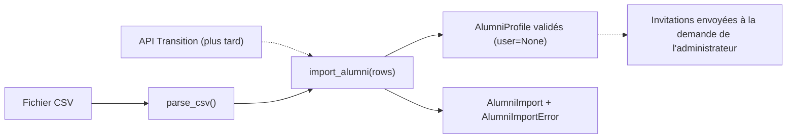
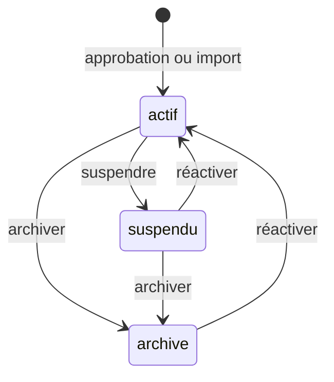

# S7 — Alumni (inscription, validation, import, annuaire)

> **Auteur** : Mathias KINNINKPO
> **Type** : Spec de slice (niveau 3 — slice complexe) · **Sprint** : 2 · **Vague** : V1 · **Priorité** : P0
> **Branche** : `feat/s7-alumni` (workspace + api + frontend)
> **Références** : [Architecture (niveau 1)](2026-06-20-architecture-socle-technique-design.md) · [Overview Sprint 2](2026-08-02-sprint2-overview.md) · [CR S5 — socle métier](../../done/2026-08-02-sprint2-s5-socle-metier.md)

---

## 1. Contexte et objectif

BAMFA n'a aucun système structuré pour recenser ses membres. Le cahier des charges en fait un objectif spécifique (« mettre en place une base de données centralisée, fiable et évolutive des alumni ») et un indicateur de succès (« nombre d'alumni inscrits », « taux de complétude des profils »).

S7 livre cette base et ses deux portes d'entrée : **l'inscription en ligne validée par l'administration** et **l'import administrateur** (qui tient lieu de synchronisation depuis la plateforme Transition tant qu'aucune API n'existe). Elle livre aussi l'**annuaire** et la **recherche multicritères** demandés côté public et côté administration.

S7 est prise tôt dans le sprint parce qu'elle débloque **S9** (ciblage des opportunités), **S13** (succès alumni) et **S17** (messaging et statistiques).

## 2. Périmètre

### Dans le périmètre

1. Inscription publique → demande en `en_attente`.
2. Validation ou rejet par l'administration, avec trace et motif, et notification par email.
3. Import de fichier CSV depuis le back-office : idempotent, transactionnel, avec rapport persisté.
4. Récupération d'accès : flux « définir mon mot de passe par lien signé », commun aux deux portes d'entrée.
5. Annuaire à trois niveaux de visibilité + recherche et filtres multicritères.
6. Gestion du cycle de vie du membre : suspension, réactivation, archivage.
7. Espace alumni connecté **minimal** : une page d'accueil (identité, complétude, accès à l'annuaire).
8. Socle de permissions DRF réutilisable dans `apps/common`.

### Hors périmètre, explicitement

- **Photo de profil** et socle média (`MEDIA_URL` / `MEDIA_ROOT` / Pillow absents du socle) : le champ n'est pas créé, l'upload arrivera avec le socle média.
- **Mot de passe oublié** : le socle de jeton signé est posé et réutilisable, mais l'endpoint n'est pas livré.
- **Suppression dure** d'un profil et **anonymisation RGPD** : l'archivage tient lieu de suppression (voir §4, décision 11).
- **API Transition réelle**, export CSV de l'annuaire.
- **Édition de son profil depuis l'interface** : l'API `PATCH /moi/` est livrée et testée, l'écran d'édition ne l'est pas (voir §4, décision 12).
- Opportunités, événements, newsletter, messaging, dons, statistiques : seules les interfaces d'intégration décrites au §14 sont préparées.

## 3. Contradictions relevées dans les documents et arbitrages

| # | Point | Origine du conflit | Arbitrage retenu |
|---|---|---|---|
| A | Annuaire public ou réservé aux connectés ? | Le cahier des charges §3.1 place l'annuaire côté **site public** ; le tableau des rôles de l'architecture donne à *Alumni* « annuaire **connecté** » | **Les deux**, avec deux niveaux de champs et un consentement par alumni (§10) |
| B | `ALUMNI_PROFILE }o--\|\| MANDATE` (relation obligatoire dans l'ERD) | Un alumni n'appartient pas à un mandat du bureau BAMFA ; le mandat sert à afficher « l'équipe par mandat » | `promotion` (cohorte MCF) **obligatoire** et distincte de `mandate`, **FK nullable** qui servira à S13 et aux pages d'équipe |
| C | « Récupération / mise à jour des infos alumni depuis Transition » | Listé comme fonctionnalité de Phase 1, alors qu'aucune API Transition n'est disponible | L'import de S7 **est** ce mécanisme ; son cœur est **neutre vis-à-vis de la source** (§8) pour qu'une API Transition l'alimente plus tard sans le modifier |
| D | « Supprimer des profils » (cahier des charges §B) | Incompatible avec l'exigence « le rejet doit conserver une trace » | **Suppression logique** (statut `archive`) ; la suppression dure reste une opération de super-administration hors API |
| E | Statut `suspendu` | Aucun document ne précise s'il bloque la connexion | **Il la bloque** : le profil est retiré de l'annuaire et le `User` associé est désactivé (§6.3) |

## 4. Décisions de conception

Les douze décisions que cette spec doit trancher, et ce qui est retenu.

**1. Différence entre `User` et `AlumniProfile`.** `User` est un **compte de connexion** ; `AlumniProfile` est un **membre reconnu par BAMFA**. Les deux sont indépendants : un membre peut exister sans compte (cas d'un import), et un compte peut exister sans profil alumni (cas d'un rédacteur ou d'un trésorier). Le lien est un `OneToOneField(User, null=True)` porté par le profil.

**2. La demande est découplée du membre.** `AlumniRegistration` porte le cycle de vie de la *candidature* (`en_attente` → `approuvee` | `rejetee`), `AlumniProfile` celui du *membre* (`actif` | `suspendu` | `archive`). Deux jeux de statuts lisibles au lieu d'un champ fourre-tout : « rejeté » qualifie une demande, « suspendu » qualifie un membre. Un rejet ne crée **aucun** `User` ni profil, et conserve sa trace.

**3. Champs obligatoires du profil.** `first_name`, `last_name`, `email`, `promotion`. `country` est obligatoire **dans le formulaire public** mais porte la valeur par défaut `"Bénin"` au niveau du modèle, afin qu'un import sans colonne `pays` reste valide. Tous les autres champs sont optionnels et alimentent le taux de complétude.

**4. Un import ne crée pas de compte `User`.** Il crée des `AlumniProfile` validés avec `user=None`. La base alumni est donc immédiatement exploitable — annuaire d'administration, recherche, ciblage de S9 — sans qu'aucun compte n'existe. C'est exactement l'objectif « centraliser les alumni » du cahier des charges.

**5. Un alumni importé récupère l'accès par le même flux qu'un alumni approuvé.** Un email d'invitation contient un lien porteur d'un jeton signé ; l'alumni définit son mot de passe ; **c'est à ce moment seulement** que le `User` est créé et rattaché au profil. Un seul chemin d'accès pour les deux portes d'entrée, donc une seule surface à sécuriser et à tester.

**6. Le jeton d'invitation est sans état.** `django.core.signing.dumps` avec un `salt` dédié et `max_age = 7 jours`. **L'usage unique n'est pas stocké : il découle de l'invariante `profile.user_id is None`.** Une fois le compte créé, le jeton devient inerte de lui-même. Aucune table de jetons, aucune colonne `used_at` à maintenir cohérente.

**7. `PublishableMixin` n'est pas réutilisé.** Un profil alumni n'est pas un contenu éditorial `brouillon` / `publié` / `dépublié` : sa visibilité dépend du consentement et du statut de membre. L'y forcer créerait deux axes de visibilité contradictoires.

**8. Le taux de complétude est calculé, pas stocké.** Propriété Python sur le modèle, exposée en lecture seule par les sérialiseurs. Pas de colonne dénormalisée à resynchroniser à chaque modification de champ.

**9. Le consentement conditionne la présence dans l'annuaire, public comme connecté.** Le niveau de visibilité ne change que les *champs* affichés, jamais la *présence*. Un alumni non consentant n'apparaît que dans l'annuaire d'administration. C'est la lecture protectrice de « consentement explicite et révocable à la publication dans l'annuaire ».

**10. Les profils importés ne consentent pas par défaut.** `directory_consent` vaut `False` sauf colonne CSV explicite. Un import massif ne publie donc personne dans l'annuaire public : il remplit la base d'administration, et l'email d'invitation est l'occasion pour chaque alumni d'opter pour la publication. L'objectif « base centralisée » du cahier des charges est satisfait par l'annuaire d'administration ; l'annuaire public reste sur consentement.

**11. L'archivage ne rend pas anonyme.** `archive` masque le profil de tous les annuaires et désactive le compte, mais conserve les données. L'anonymisation est un sujet RGPD distinct, hors périmètre.

**12. L'espace alumni connecté est minimal.** Une seule page d'accueil : identité, taux de complétude, lien vers l'annuaire. L'API `GET/PATCH /alumni/moi/` est livrée, testée et documentée — l'écran d'édition arrivera dans une slice ultérieure. Justification : S7 est prise tôt pour débloquer S9, S13 et S17 ; la garder mergeable rapidement primait sur la complétude de la zone `(alumni)`.

## 5. Modèle de données

### 5.1 Mixin de champs de personne (abstrait)

`AlumniFieldsMixin` porte les champs partagés par la demande et le profil, ce qui évite de dupliquer une vingtaine de définitions. Noms de champs en anglais, `verbose_name` en français — convention du dépôt.

| Champ | Type | Obligatoire | Notes |
|---|---|---|---|
| `first_name` | `CharField(150)` | oui | |
| `last_name` | `CharField(150)` | oui | |
| `email` | `EmailField` | oui | **normalisé en minuscules et sans espaces** avant toute écriture |
| `promotion` | `PositiveSmallIntegerField` | oui | année de cohorte MCF ; validée entre 2010 et l'année courante + 1 |
| `country` | `CharField(100)` | défaut `"Bénin"` | normalisé (espaces retirés) |
| `phone` | `CharField(30)` | non | |
| `city` | `CharField(100)` | non | |
| `university` | `CharField(200)` | non | établissement de la bourse MCF |
| `mcf_program` | `CharField(200)` | non | programme MCF suivi |
| `sector` | `CharField(50, choices=Sector)` | non | **liste fermée** — condition d'un filtrage fiable |
| `current_position` | `CharField(200)` | non | |
| `organization` | `CharField(200)` | non | |
| `bio` | `TextField` | non | biographie courte |
| `linkedin_url` | `URLField` | non | |
| `birth_date` | `DateField` | non | |
| `gender` | `CharField(20, choices=Gender)` | non | `femme` / `homme` / `autre` / `non_precise` |

`Sector` (liste fermée) : agriculture et agro-industrie · santé · éducation et formation · technologies et numérique · finance et assurance · entrepreneuriat et PME · énergie et environnement · industrie et BTP · commerce et distribution · transport et logistique · administration publique · société civile et ONG · arts, culture et médias · recherche · autre.

**Normalisation de l'email.** `UserManager.normalize_email` de Django ne met en minuscules **que le domaine**. `apps/alumni` normalise donc l'adresse complète lui-même (`strip().lower()`), à l'écriture du modèle, dans le sérialiseur et dans l'import. C'est cette normalisation qui rend les contraintes d'unicité effectivement insensibles à la casse et la détection de doublons fiable.

### 5.2 `AlumniRegistration` — la demande

`AlumniFieldsMixin` + :

| Champ | Type | Notes |
|---|---|---|
| `directory_consent` | `BooleanField(default=False)` | choix explicite du demandeur |
| `status` | `CharField(choices=Status)` | `en_attente` (défaut) → `approuvee` \| `rejetee` |
| `submitted_at` | `DateTimeField(auto_now_add)` | |
| `reviewed_by` | `FK(User, null, SET_NULL)` | qui a tranché |
| `reviewed_at` | `DateTimeField(null)` | quand |
| `rejection_reason` | `TextField(blank)` | motif du rejet, facultatif |
| `profile` | `FK(AlumniProfile, null, SET_NULL)` | profil créé à l'approbation — trace du lien demande ↔ membre |

**Contrainte** : `UniqueConstraint(fields=["email"], condition=Q(status="en_attente"))`. Elle interdit deux demandes en attente pour la même adresse, tout en autorisant une nouvelle candidature après un rejet.

**Ordre** : `-submitted_at` (la file d'attente se lit du plus récent au plus ancien).

### 5.3 `AlumniProfile` — le membre

`AlumniFieldsMixin` (avec `email` en `unique=True`) + :

| Champ | Type | Notes |
|---|---|---|
| `user` | `OneToOneField(User, null, blank, SET_NULL, related_name="alumni_profile")` | **le profil vit sans compte** |
| `directory_consent` | `BooleanField(default=False)` | révocable par l'alumni |
| `status` | `CharField(choices=Status)` | `actif` (défaut) \| `suspendu` \| `archive` |
| `mandate` | `FK(Mandate, null, blank, SET_NULL)` | rattachement à un mandat du bureau — sert à S13 et aux pages d'équipe |
| `source` | `CharField(choices=Source)` | `inscription` \| `import` — traçabilité de la porte d'entrée |
| `created_at` / `updated_at` | `DateTimeField` | `auto_now_add` / `auto_now` |

**Propriété calculée** `completeness` : pourcentage de champs optionnels renseignés (les champs obligatoires sont exclus du calcul — ils sont toujours remplis, les compter fausserait l'indicateur vers le haut). Exposée en lecture seule.

**QuerySet dédié** : `AlumniProfileQuerySet.in_directory()` = `filter(status=ACTIF, directory_consent=True)`. Point d'entrée **unique** de tous les annuaires non-administratifs : la règle de visibilité est écrite une fois, ce qui supprime le risque d'un filtre oublié dans une vue.

**Ordre** : `last_name`, `first_name`.

### 5.4 `AlumniImport` et `AlumniImportError` — le rapport d'import

`AlumniImport` : `uploaded_by` (FK `User`, `SET_NULL`), `filename`, `strict` (booléen), `created_at`, et les compteurs `rows_total`, `rows_created`, `rows_updated`, `rows_skipped`, `rows_failed`. Ordre `-created_at`.

`AlumniImportError` : `import_run` (FK, `CASCADE`, `related_name="errors"`), `line_number`, `raw_row` (`JSONField` — la ligne brute, pour que l'administrateur puisse corriger sans rouvrir le fichier), `message`.

### 5.5 Ce qui n'est pas créé

Aucune table de jetons d'invitation (décision 6). Aucun modèle de rôle (les groupes Django de S1 suffisent, `Alumni` est déjà créé par la migration `accounts.0002_seed_roles`). Aucun champ photo (hors périmètre).

## 6. Cycles de vie

### 6.1 Inscription publique

En cas de rejet : la demande passe en `rejetee` avec `reviewed_by`, `reviewed_at` et le motif ; un email « rejetée » est envoyé (le motif y figure s'il est renseigné) ; **aucun `User` ni profil n'est créé**.

### 6.2 Import administrateur

L'envoi des invitations n'est **pas** automatique à l'import : il reste une action explicite par profil (`POST .../inviter/`). Un import de plusieurs centaines de lignes ne doit pas déclencher un envoi massif non voulu.

### 6.3 Cycle de vie du membre

`suspendre` et `archiver` posent `user.is_active = False` si un compte existe ; `reactiver` le repose à `True`.

**Effet immédiat de la suspension sur les sessions en cours** : `JWTAuthentication.get_user` de SimpleJWT refuse un utilisateur inactif. Un access token déjà émis cesse donc de fonctionner **à la requête suivante**, sans qu'il soit nécessaire de mettre les tokens sur liste noire. Comportement vérifié par un test dédié (§13).

## 7. Permissions

### 7.1 Socle réutilisable — `apps/common/permissions.py`

Le socle S5 ne contient **aucune** classe de permission DRF, et `DEFAULT_PERMISSION_CLASSES` n'est pas défini dans les réglages : le défaut DRF est donc `AllowAny`. **Chaque vue de S7 déclare explicitement ses permissions**, sans exception.

`HasAnyRole(BasePermission)` : classe de base paramétrée par un attribut `roles`, qui accorde l'accès si l'utilisateur est authentifié **et** (`is_superuser` **ou** membre de l'un des groupes listés). Le passe-droit super-utilisateur est indispensable : l'administrateur de démonstration est superutilisateur, et le front considère déjà `is_superuser` comme équivalent au rôle `Administrateur`.

Classes concrètes : `IsAdministrateur`, `IsAdministrateurOrSecretaire`, `IsAlumni`.

Ce fichier vit dans `apps/common` et non dans `apps/alumni` parce que S9 et S17 en auront besoin à l'identique. C'est une **modification d'un fichier partagé** : à merger tôt (§15).

### 7.2 Permissions propres à la slice — `apps/alumni/permissions.py`

`CanReviewRegistrations` (Administrateur) · `CanManageDirectory` (Administrateur) · `CanReadAdminDirectory` et `CanImportAlumni` (Administrateur ou Secrétaire) · `IsOwnProfile` (niveau objet).

### 7.3 Matrice

| Action | Anonyme | Alumni | Rédacteur / Trésorier | Secrétaire | Administrateur |
|---|---|---|---|---|---|
| Soumettre une demande | ✅ | ✅ | ✅ | ✅ | ✅ |
| Annuaire public (champs restreints) | ✅ | ✅ | ✅ | ✅ | ✅ |
| Annuaire connecté (champs enrichis) | — | ✅ | — | ✅ | ✅ |
| Lire la file des demandes | — | — | — | ✅ | ✅ |
| Approuver / rejeter une demande | — | — | — | — | ✅ |
| Annuaire d'administration (tout, email inclus) | — | — | — | ✅ | ✅ |
| Éditer un profil quelconque | — | — | — | — | ✅ |
| Suspendre / réactiver / archiver / (ré)inviter | — | — | — | — | ✅ |
| Importer un fichier | — | — | — | ✅ | ✅ |
| Lire l'historique des imports | — | — | — | ✅ | ✅ |
| Lire et éditer **son** profil | — | ✅ | — | ✅ | ✅ |

Le partage Secrétaire / Administrateur suit une ligne simple : la Secrétaire **alimente et consulte** la base ; l'Administrateur seul pose les **actes de gouvernance** (approuver, rejeter, suspendre, archiver) et déclenche les envois d'email. Les rôles Rédacteur et Trésorier n'ont aucun accès au module.

## 8. Services

Deux fichiers focalisés plutôt qu'un `services.py` fourre-tout.

### 8.1 `apps/alumni/services.py`

| Fonction | Effet |
|---|---|
| `approve_registration(registration, *, reviewer)` | **Atomique** : crée le `AlumniProfile` (`actif`, `user=None`, `source=inscription`) depuis les champs de la demande, lie `registration.profile`, pose `status`, `reviewed_by`, `reviewed_at`, puis envoie l'email d'approbation avec le lien d'invitation |
| `reject_registration(registration, *, reviewer, reason="")` | **Atomique** : pose `rejetee` + trace + motif, envoie l'email de rejet |
| `build_invitation_token(profile)` | `signing.dumps({"profile_id": …}, salt="alumni-invitation")` |
| `resolve_invitation_token(token)` | Renvoie le profil ; lève une erreur explicite si le jeton est altéré, expiré, ou si le profil possède déjà un compte |
| `claim_invitation(profile, *, password)` | **Atomique** : crée le `User` (email normalisé du profil, `is_active=True`), l'ajoute au groupe `Alumni`, le rattache au profil |
| `send_invitation(profile)` | Envoie l'email d'invitation — utilisé pour les profils importés et pour les relances |
| `suspend_profile` / `reactivate_profile` / `archive_profile` | Changent le statut et pilotent `user.is_active` |

### 8.2 `apps/alumni/imports.py`

Le cœur est **neutre vis-à-vis de la source** — c'est ce qui répond à l'arbitrage C :

- `import_alumni(rows, *, uploaded_by, strict=False, filename="") -> AlumniImport` consomme un **itérable de `(numéro_de_ligne, dict)`**. Il ne sait rien du CSV.
- `parse_csv(file) -> Iterator[tuple[int, dict]]` est un adaptateur mince : détection du séparateur, tolérance du BOM, normalisation des en-têtes.

Le jour où une API Transition existe, elle écrit un second adaptateur et alimente le **même** `import_alumni`, sans le modifier ni le retester. Aucun registre de providers n'est inventé d'avance.

## 9. Format CSV et règles d'import

### 9.1 Format accepté

- Encodage **UTF-8**, BOM toléré.
- Séparateur **`,` ou `;`**, détecté automatiquement (`csv.Sniffer`, repli sur `,`).
- **En-têtes nommés, ordre libre.** Normalisation des en-têtes : minuscules, espaces retirés, accents supprimés, espaces internes remplacés par `_` (« Prénom » → `prenom`). Une colonne inconnue est ignorée sans erreur.
- Colonnes **requises** : `email`, `nom`, `prenom`, `promotion`.
- Colonnes **optionnelles** : `pays`, `telephone`, `ville`, `universite`, `programme_mcf`, `secteur`, `poste`, `organisation`, `bio`, `linkedin`, `date_naissance`, `genre`, `consentement_annuaire`.
- Une colonne requise absente du fichier fait échouer l'import **entier** avant toute écriture (erreur de format, pas erreur de ligne).

### 9.2 Idempotence et doublons

- **Clé naturelle : `email` normalisé.** Profil inexistant → création ; profil existant → mise à jour.
- **Une mise à jour n'écrase jamais une valeur existante par du vide.** Une colonne vide dans le fichier laisse le champ inchangé. Sans cette règle, un export partiel de Transition effacerait des données saisies par l'alumni lui-même.
- **Deux passes du même fichier donnent zéro création à la seconde** — c'est l'assertion centrale du test d'idempotence.
- **Doublon à l'intérieur du fichier** : la dernière occurrence gagne, un avertissement est consigné au rapport.
- Les profils créés portent `status=actif`, `source=import`, et `directory_consent=False` sauf colonne explicite (décision 10).

### 9.3 Transactionnalité

- **Mode par défaut** (`strict=False`) : une transaction pour l'import. Les lignes valides sont écrites, les lignes invalides sont consignées dans `AlumniImportError` **sans annuler** les lignes valides. C'est le comportement utile sur un fichier réel, toujours imparfait.
- **Mode strict** (`strict=True`) : la première ligne invalide annule **tout** l'import. Les profils sont écrits dans un `transaction.atomic` interrompu au premier échec ; le rapport et ses lignes en erreur sont écrits **après** l'annulation, dans une écriture distincte, de sorte que la trace survive au rollback.
- Dans les deux modes, un rapport `AlumniImport` est **toujours** créé, y compris quand rien n'a été importé : c'est la trace de la tentative.

## 10. Visibilité de l'annuaire

Trois niveaux. La **présence** dans l'annuaire est conditionnée à `status=actif` **et** `directory_consent=True` (décision 9) — un seul point d'entrée, `AlumniProfileQuerySet.in_directory()`. Le niveau ne détermine que les **champs**.

| Niveau | Qui | Champs exposés |
|---|---|---|
| **Public** | tout le monde | prénom, nom, promotion, secteur, pays, poste, organisation |
| **Connecté** | Alumni, Secrétaire, Administrateur | le niveau public **+** ville, biographie, LinkedIn |
| **Administration** | Secrétaire, Administrateur | **tous** les champs, y compris email et téléphone, **et** les profils sans consentement, suspendus et archivés |

`email` et `phone` **ne sortent jamais** hors du niveau administration. Le niveau est choisi par la vue selon le rôle, sur un même URL, ce qui évite au front de connaître deux endpoints d'annuaire.

## 11. Emails

Quatre gabarits dans `apps/alumni/templates/emails/`, en `.txt` (une variante `.html` est facultative — `send_templated_email` l'attache si elle existe). Tous partent par `send_templated_email_task.delay(...)` (asynchrone via Celery), y compris l'accusé de réception : uniformité du chemin d'envoi, et une soumission publique n'attend jamais un SMTP.

| Gabarit | Déclencheur | Destinataire | Contenu |
|---|---|---|---|
| `alumni_demande_recue` | soumission publique | le demandeur | accusé de réception, délai d'instruction |
| `alumni_demande_approuvee` | approbation | le demandeur | bienvenue + **lien d'invitation** (7 jours) |
| `alumni_demande_rejetee` | rejet | le demandeur | décision + motif s'il est renseigné |
| `alumni_invitation` | import puis action `inviter`, ou relance | l'alumni | invitation à activer son accès + **lien d'invitation** |

Le lien pointe vers le front : `{FRONTEND_BASE_URL}/alumni/activation?token=…`. Un réglage `FRONTEND_BASE_URL` est ajouté (défaut `http://localhost:3000`) — le backend n'a aujourd'hui aucun moyen de construire une URL du front.

## 12. Confidentialité des données personnelles

Le cahier des charges impose la « protection des données personnelles des membres ». Règles retenues :

1. **Consentement explicite et révocable** pour figurer dans l'annuaire ; il conditionne la présence, pas seulement les champs (décision 9). L'alumni peut le retirer via `PATCH /alumni/moi/`.
2. **Email et téléphone jamais exposés** hors du niveau administration.
3. **Pas d'énumération de comptes.** Une demande portant une adresse déjà connue — profil existant *quel que soit son statut*, ou demande déjà en attente — reçoit une **réponse 400 au message unique et neutre** : « Une demande est déjà enregistrée pour cette adresse e-mail. » Le message ne permet pas de distinguer « déjà membre » de « demande en cours », donc ne révèle pas qui est membre. Le cas d'un profil archivé tombe sous le même message ; sa réactivation est une opération d'administration.
4. **Jetons d'invitation** signés, valables 7 jours, à usage unique par construction (décision 6).
5. **Traçabilité des actes** : toute approbation, rejet ou import porte son auteur et sa date.
6. L'archivage **conserve** les données (décision 11) ; l'anonymisation est hors périmètre.

## 13. Surface API

Sous `/api/v1/alumni/`. Pagination, filtres, recherche et format d'erreur sont ceux du socle S5 (aucune configuration locale). Toutes les actions personnalisées sont annotées `@extend_schema` avec le tag `alumni` pour l'OpenAPI.

### Public

| Méthode | Chemin | Permission | Effet |
|---|---|---|---|
| `POST` | `inscriptions/` | `AllowAny` | Crée une demande (201). Doublon → 400, message neutre |
| `GET` | `annuaire/` | `AllowAny` | Annuaire paginé. Filtres `promotion`, `secteur`, `pays` ; recherche sur nom, prénom, organisation, poste ; tri sur `last_name`, `promotion`. Sérialiseur choisi selon le rôle |
| `GET` | `annuaire/{id}/` | `AllowAny` | Détail, mêmes règles de champs |
| `POST` | `invitation/verifier/` | `AllowAny` | Valide un jeton, renvoie prénom et email pour l'écran d'activation |
| `POST` | `invitation/activer/` | `AllowAny` | `{token, password}` → crée le compte (200). Le mot de passe passe par les validateurs Django |

### Administration

| Méthode | Chemin | Permission |
|---|---|---|
| `GET` | `admin/inscriptions/` (+ `{id}/`) — filtre `status`, recherche email/nom | `CanReadAdminDirectory` |
| `POST` | `admin/inscriptions/{id}/approuver/` | `CanReviewRegistrations` |
| `POST` | `admin/inscriptions/{id}/rejeter/` — corps `{motif}` facultatif | `CanReviewRegistrations` |
| `GET` | `admin/profils/` — filtres `status`, `promotion`, `secteur`, `pays`, `consentement`, **`a_un_compte`** (booléen : `user` renseigné ou non — sert à repérer les profils importés qui n'ont pas encore activé leur accès) ; recherche email incluse | `CanReadAdminDirectory` |
| `GET` / `PATCH` | `admin/profils/{id}/` — `PATCH` réservé à l'Administrateur | `CanReadAdminDirectory` / `CanManageDirectory` |
| `POST` | `admin/profils/{id}/suspendre/` · `reactiver/` · `archiver/` · `inviter/` | `CanManageDirectory` |
| `POST` | `admin/imports/` — multipart, champs `fichier` et `strict` → renvoie le rapport | `CanImportAlumni` |
| `GET` | `admin/imports/` (+ `{id}/` avec ses erreurs) | `CanImportAlumni` |

### Alumni

| Méthode | Chemin | Permission | Effet |
|---|---|---|---|
| `GET` / `PATCH` | `moi/` | `IsAuthenticated` + `IsOwnProfile` | Son profil. **404** si l'utilisateur n'a pas de profil alumni. Champs modifiables : coordonnées, parcours, biographie, LinkedIn, `directory_consent`. `email`, `promotion` et `status` restent réservés à l'administration |

## 14. Crochets pour les slices suivantes

Aucun endpoint spéculatif n'est créé. Ce qui est délibérément mis en place :

- **S9 — Opportunités** : les filtres de `admin/profils/` **sont** l'API de ciblage (`promotion`, `secteur`, `pays`, `status`, `a_un_compte`). S9 réutilise le queryset filtré pour construire sa sélection de destinataires.
- **S17 — Messaging et statistiques** : mêmes filtres pour la sélection ; comptages par `status` et `promotion` directement disponibles.
- **S13 — Réalisations et succès alumni** : `ALUMNI_SUCCESS` pointera vers `AlumniProfile` (clé stable, indépendante de l'existence d'un compte), pas vers `User`.
- **`mandate`** : FK nullable déjà en place pour les pages « équipe par mandat ».
- **`apps/common/permissions.py`** : `HasAnyRole` est écrit pour être réutilisé tel quel par toutes les slices suivantes.

## 15. Impacts sur le code existant

À signaler explicitement, ce sont des fichiers déjà livrés et revus :

| Fichier | Modification | Raison |
|---|---|---|
| `config/settings/base.py` | `apps.alumni` dans `INSTALLED_APPS` ; réglage `FRONTEND_BASE_URL` | app + construction des liens d'invitation |
| `config/urls.py` | `path("api/v1/alumni/", include("apps.alumni.urls"))` | routage |
| `apps/common/permissions.py` | **nouveau fichier** dans un module partagé | socle de permissions (§7.1) — **à merger tôt** |
| `apps/common/management/commands/seed_demo.py` | crée le profil de `alumni@bamfa.org` + quelques profils de démonstration, **idempotent** | sans données, l'annuaire est vide en développement |
| `components/admin/Sidebar.tsx` | l'entrée `Alumni` perd `soon: true` et reçoit `href: "/admin/alumni"` | la page existe enfin |
| `components/layout/Header.tsx` | entrée `Alumni` → `/alumni` | annuaire public |
| `components/auth/LoginForm.tsx` | redirection **dépendante du rôle** : rôles staff → `/admin`, sinon → `/espace` | aujourd'hui la redirection est toujours `/admin`, où la garde bloquerait un alumni |
| `middleware.ts` + `lib/auth/route-guard.ts` | `shouldRedirectToLogin` généralisée à une **liste de préfixes protégés** (`/admin`, `/espace`) ; matcher étendu | protéger la zone `(alumni)` sans dupliquer la logique |
| `components/ui/` | **nouveaux** `Table`, `Pagination`, `Select`, `Textarea`, `Modal` | premières listes d'administration du projet |
| `lib/api/schema.d.ts` | régénéré (`npm run generate:api`) | le schéma API change |

**Coordination avec Dev A (S6 — Contenus)** : les primitives `Table`, `Pagination`, `Select`, `Textarea`, `Modal` et le fichier `apps/common/permissions.py` sont des points de contact partagés. Ils doivent être mergés tôt, en petits lots, pour éviter deux implémentations divergentes.

## 16. Frontend

### Pages publiques

- **`/alumni`** — annuaire : barre de recherche, filtres (promotion, secteur, pays), grille de cartes, pagination. Les champs affichés dépendent de l'authentification, servis par le même endpoint.
- **`/alumni/inscription`** — formulaire sectionné (identité · parcours · consentement). Validation **écrite à la main**, comme `ContactForm` : aucune dépendance de formulaire n'est introduite, la cohérence du dépôt primant sur le confort d'écriture.
- **`/alumni/activation?token=…`** — vérifie le jeton, affiche la définition du mot de passe (champ `Field type="password"`, qui gère déjà l'affichage/masquage), puis redirige vers `/connexion`. Messages distincts pour un jeton expiré, altéré, ou déjà utilisé.

### Back-office

- **`/admin/alumni`** — profils : table, filtres, pagination, actions suspendre / réactiver / archiver / inviter.
- **`/admin/alumni/inscriptions`** — file d'attente : table, approbation, rejet avec saisie du motif en modale.
- **`/admin/alumni/imports`** — dépôt du fichier, choix du mode strict, historique, rapport détaillé ligne à ligne.

### Espace alumni

**`app/(alumni)/espace/`** — page d'accueil minimale : « Bonjour {prénom} », taux de complétude, lien vers l'annuaire. Pas de formulaire d'édition (décision 12).

### Accès aux données

`lib/alumni/` : hooks react-query sur le modèle de `useAuth` — `useDirectory`, `useRegistrations`, `useProfiles`, `useImports` — et les types dérivés du schéma régénéré.

## 17. Tests

### Backend — `tests/test_alumni_*.py`

Les tests vivent dans `tests/` à la racine, conformément à `pytest.ini` (`testpaths = tests`) et à la convention établie en S5. **Un répertoire `apps/alumni/tests/` ne serait pas collecté** : c'est pourquoi la nomenclature `models / serializers / views / permissions / services` s'applique au code de l'app, mais les tests restent centralisés.

| Fichier | Couverture |
|---|---|
| `test_alumni_models.py` | normalisation de l'email (casse et espaces), contrainte d'unicité de la demande en attente, réinscription possible après rejet, calcul de la complétude, `in_directory()` |
| `test_alumni_registration_api.py` | création 201, statut initial, champs requis, doublon → 400 au message neutre (profil existant, demande en attente, profil archivé), envoi de l'accusé de réception |
| `test_alumni_review_api.py` | l'approbation crée le profil, lie la demande, envoie l'email ; le rejet conserve motif et trace **sans créer de compte** ; Secrétaire → 403 sur approuver ; Alumni → 403 ; anonyme → 401 |
| `test_alumni_invitation.py` | jeton valide, expiré, altéré ; l'activation crée le `User` et l'ajoute au groupe `Alumni` ; **rejeu refusé** après création du compte ; validateurs de mot de passe appliqués |
| `test_alumni_directory_api.py` | email et téléphone absents des niveaux public et connecté ; exclusion des non-consentants, suspendus et archivés ; enrichissement des champs pour un connecté ; filtres, recherche, pagination |
| `test_alumni_admin_api.py` | matrice de permissions endpoint par endpoint et rôle par rôle ; la suspension pose `user.is_active=False` **et une requête authentifiée suivante échoue** ; `PATCH` de profil ; filtre `a_un_compte` |
| `test_alumni_import.py` | création puis **idempotence sur deux passes (zéro création)** ; séparateur `;` ; BOM ; colonne requise absente → échec avant écriture ; ligne invalide consignée au rapport sans bloquer les valides ; doublon intra-fichier ; **mode strict → annulation complète, rapport conservé** ; pas d'écrasement par du vide ; `directory_consent=False` par défaut |
| `test_alumni_self_api.py` | `GET` / `PATCH` de son profil ; 404 sans profil ; refus de modifier `status`, `promotion`, `email` ; impossibilité d'atteindre le profil d'autrui |
| `test_permissions.py` | `HasAnyRole` : rôle présent, rôle absent, passe-droit super-utilisateur, utilisateur anonyme |

### Frontend

Formulaire d'inscription (validation, soumission, erreurs serveur) · annuaire (filtres, pagination, absence des champs privés) · écrans d'administration avec API simulée (`axios-mock-adapter`) · dépôt d'import et affichage du rapport · écran d'activation (jeton valide / invalide) · `route-guard` étendue aux deux préfixes · redirection de connexion selon le rôle · entrée `Alumni` du `Sidebar` devenue active.

## 18. Definition of Done

- [ ] App `apps/alumni` avec `models / serializers / views / permissions / services / imports / urls` et ses migrations.
- [ ] `apps/common/permissions.py` livré et réutilisable.
- [ ] Inscription publique, approbation, rejet avec trace et motif, emails envoyés.
- [ ] Import de fichier idempotent, transactionnel, avec rapport persisté et lignes en erreur consultables.
- [ ] Flux d'invitation : jeton signé, usage unique, création du compte et du rôle `Alumni`.
- [ ] Annuaire à trois niveaux, filtres et recherche multicritères.
- [ ] Cycle de vie du membre : suspension, réactivation, archivage, avec effet sur la connexion.
- [ ] Permissions appliquées côté backend sur **tous** les endpoints, et couvertes par des tests.
- [ ] Endpoints documentés dans OpenAPI ; `schema.d.ts` régénéré.
- [ ] Pages publiques, back-office et page d'espace alumni livrées ; entrées de navigation activées.
- [ ] `pytest` vert · `ruff check .` propre · `python manage.py makemigrations --check` propre · `npm run test` vert · `npm run build` vert.
- [ ] CR de slice rédigé dans `docs/done/2026-08-03-sprint2-s7-alumni.md`.

## 19. Risques

| Risque | Atténuation |
|---|---|
| Annuaire public vide après un import massif (consentement à `False`) | Assumé et documenté (décision 10) : l'annuaire d'administration porte la valeur métier immédiate, l'invitation sollicite le consentement |
| Le flux de mot de passe élargit le périmètre de S7 | Assumé : indispensable à l'approche retenue, et il servira de socle au « mot de passe oublié » |
| Divergence des primitives d'interface avec S6 | Merges fréquents en petits lots ; primitives poussées tôt (§15) |
| Fichiers d'import volumineux traités de façon synchrone | Acceptable au volume attendu de BAMFA ; le bascule vers une tâche Celery est triviale, `import_alumni` étant déjà découplé de la requête HTTP |
| Fuite d'un champ privé par un sérialiseur mal choisi | Un unique `in_directory()` pour la présence, et des tests qui asserte l'**absence** de `email` et `phone` à chaque niveau |
